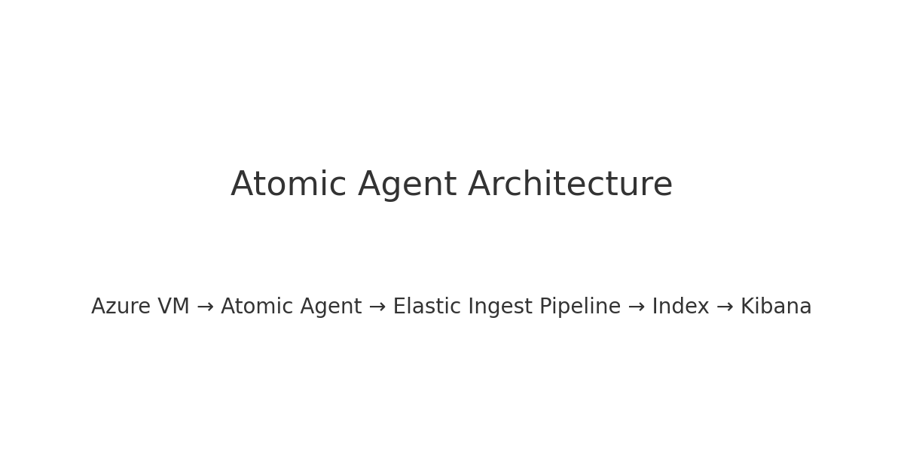
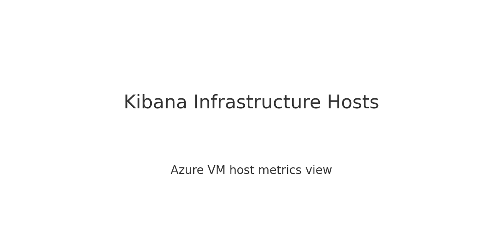
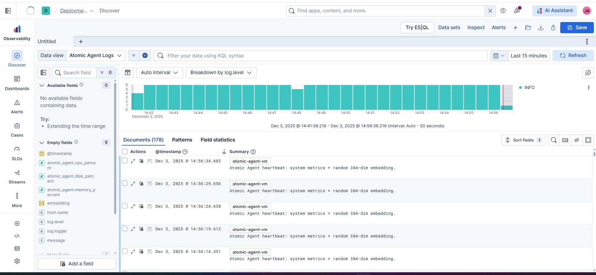
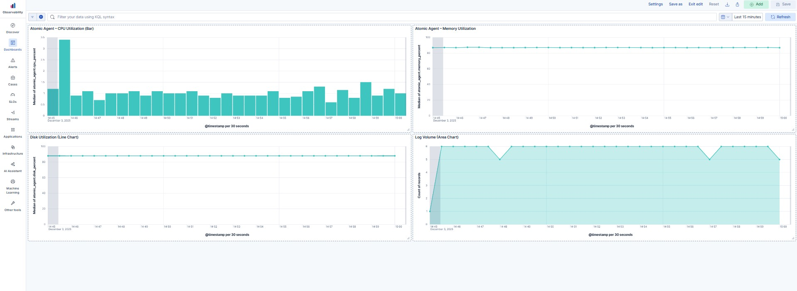

# Atomic Agent – Azure + Elastic Observability

A **production-style observability project** demonstrating how a lightweight **Atomic Agent** running on an **Azure VM** emits system metrics, structured logs, and operational signals into the **Elastic Stack**, enabling real-time monitoring through **Kibana dashboards**.

This project is designed as a **portfolio-grade example** aligned with **Platform Engineering**, **Cloud Observability**, and **Agentic AI foundations**.

---

## 🚀 Project Overview

The Atomic Agent runs as a Python process on an Azure Linux VM and periodically emits:

- Host-level system metrics (CPU, memory, disk)
- Structured JSON logs with parsed fields
- Heartbeat-style operational signals

Telemetry flows through Elastic ingest pipelines into Elasticsearch indices and is visualized using Kibana’s **Observability** and **Infrastructure** views.

---

## 🏗 Architecture



**Data Flow:**

Azure VM  
→ Atomic Agent (Python)  
→ Elastic Ingest Pipeline  
→ Elasticsearch Index  
→ Kibana (Discover, Dashboards, Infrastructure)

---

## 🔍 What This Project Demonstrates

- Azure VM provisioning and secure SSH-based access
- Custom agent-based telemetry generation (not platform defaults)
- Structured logging with parsed, queryable fields
- Elastic Observability (Logs, Metrics, Infrastructure views)
- Kibana dashboards built from real, live telemetry
- Production-style repository layout and documentation

---

## 📊 Observability Evidence

### Azure VM Infrastructure Metrics


Shows real-time CPU, memory, and disk utilization for the Azure VM host as detected by Elastic Infrastructure monitoring.

---

### Parsed Logs in Kibana Discover


Demonstrates structured logs emitted by the Atomic Agent, including custom fields such as CPU usage, memory usage, disk usage, and operational metadata.

---

### Kibana Observability Dashboard


A custom dashboard visualizing:
- CPU utilization trends
- Memory consumption
- Disk usage
- Log volume over time

---

## 🧠 Why This Matters (Portfolio Value)

This project goes beyond basic logging by demonstrating:

- Agent-driven telemetry instead of managed black-box metrics
- Clean separation between agent, ingestion, indexing, and visualization
- Real-world observability patterns used by SRE and Platform teams
- A strong foundation for Agentic AI systems (observe → decide → act)

---

## 🛠 Tech Stack

- **Cloud:** Azure VM (Linux)
- **Language:** Python
- **Observability:** Elastic Stack (Elasticsearch, Kibana)
- **Telemetry:** Custom Atomic Agent
- **Dashboards:** Kibana Observability & Infrastructure

---
## 🔐 Environment Configuration

This project uses environment variables for secure configuration and follows production security best practices.

- A local `.env` file is used to store sensitive values (Elastic Cloud URL, API keys, agent identifiers)
- The `.env` file is **not committed** to version control
- A `.env.example` file documents the required variables and safe defaults

To run the agent locally, create a `.env` file based on `.env.example` and populate it with your own credentials.


## 📁 Repository Structure

```
atomic-agent-azure-elastic-observability/
├── agent/                     # Atomic Agent source code
├── elastic/                   # Ingest pipelines, index templates
├── embeddings/                # Embedding generation logic (future-ready)
├── docs/                      # Design notes and documentation
├── screenshots/               # Evidence used in README
│   ├── architecture.png
│   ├── infrastructure_hosts.png
│   ├── kibana-discover-parsed-logs.jpg
│   └── kibana-observability-dashboard.jpg
├── README.md
└── .gitkeep

```

---

## ✅ Project Status

**Status:** ✅ Complete  
**Purpose:** Portfolio / Demonstration / Interview-ready

---

## 📌 Resume-Ready Summary

> Built a production-style Azure observability pipeline using a custom Python-based Atomic Agent, Elastic ingest pipelines, and Kibana dashboards to monitor real-time VM metrics and structured logs.
